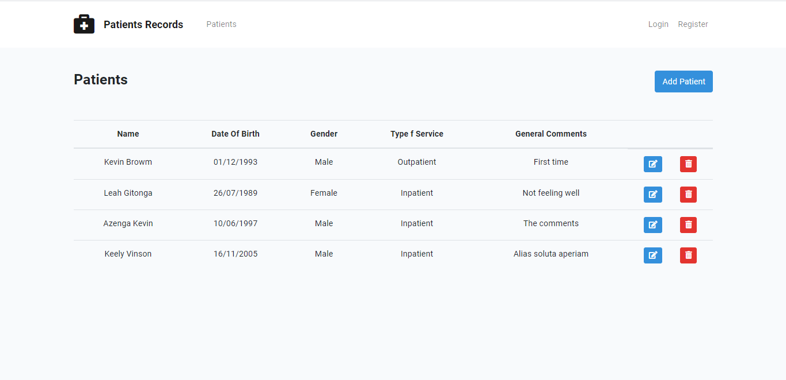
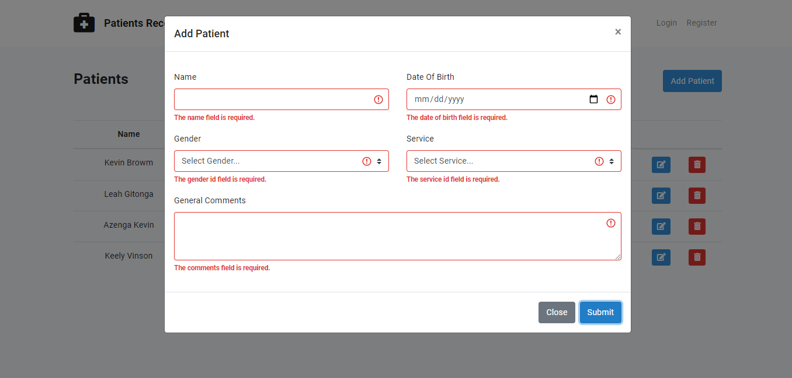
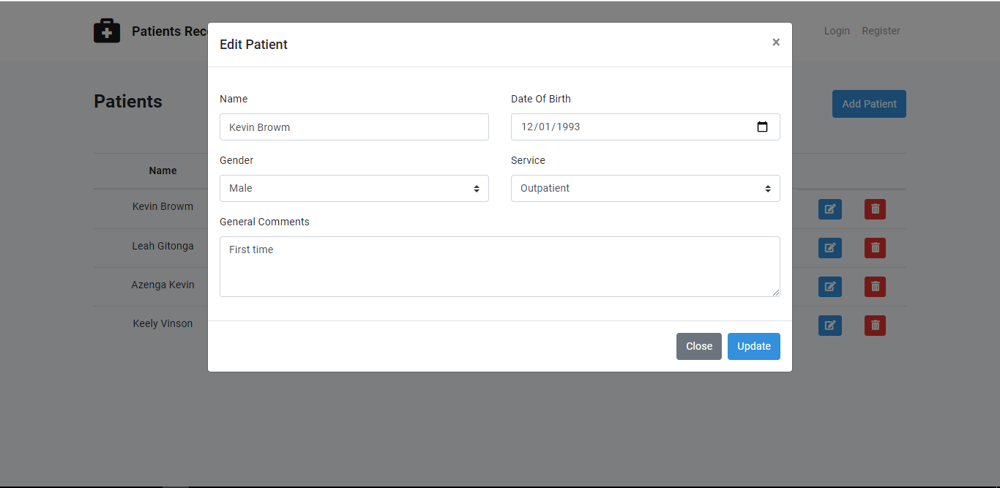
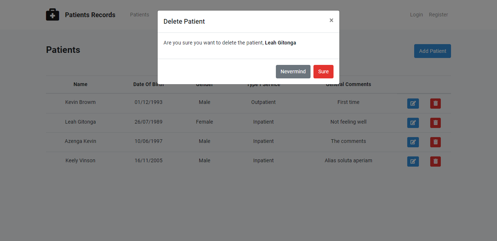

It is a laravel application

Prerequisits
============
PHP Installed
Composer Installed
MySQL Installed


- Unzip file or clone the appliction from the repository
- Run the following commands in the root directory of the project

```bash

   cp .env.example .env

   composer install

   npm install

   npm run dev

```

Configure the database credentials in your laptop. then run the foloowing commands

```bash
 php artisan migrate --seed

 php artisan serve

```

Launch your browser and visit the following url http://localhost:8000

## Patient Resource Screenshots

CRUD Screenshots

Browse Screenshot



Add Patient Screenshot



Edit / Update Patient Screenshot



Delete Patient Dialog Screenshot

